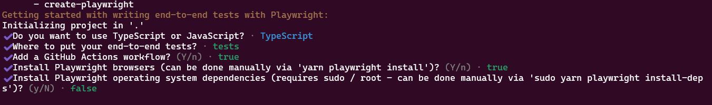
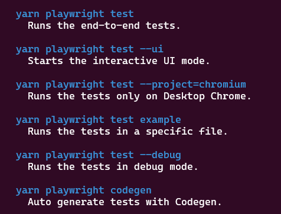
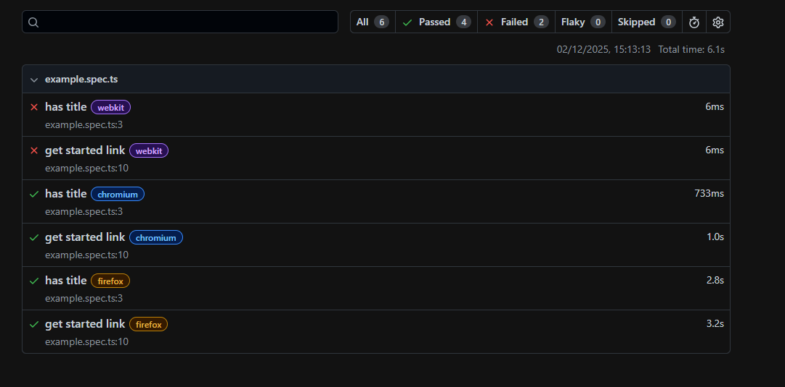
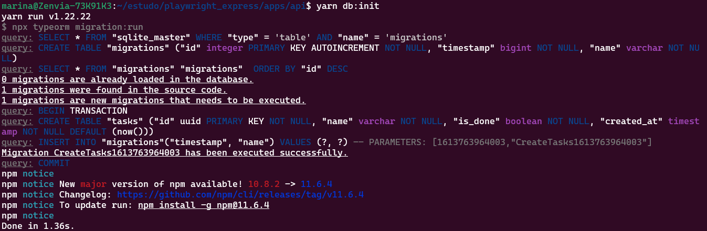
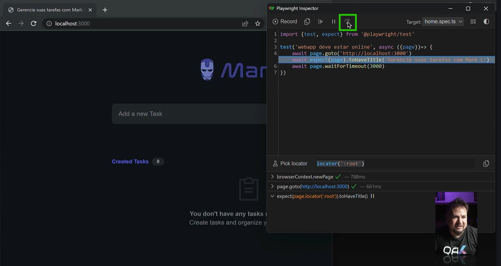
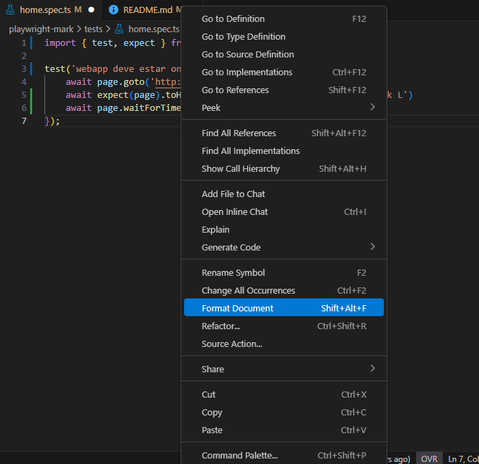
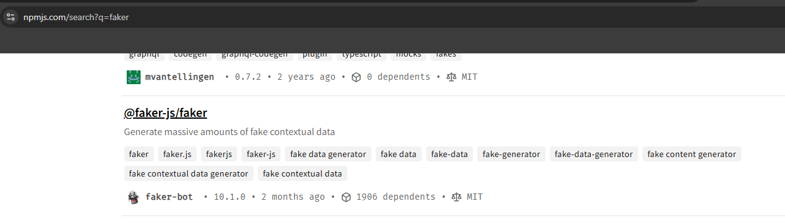
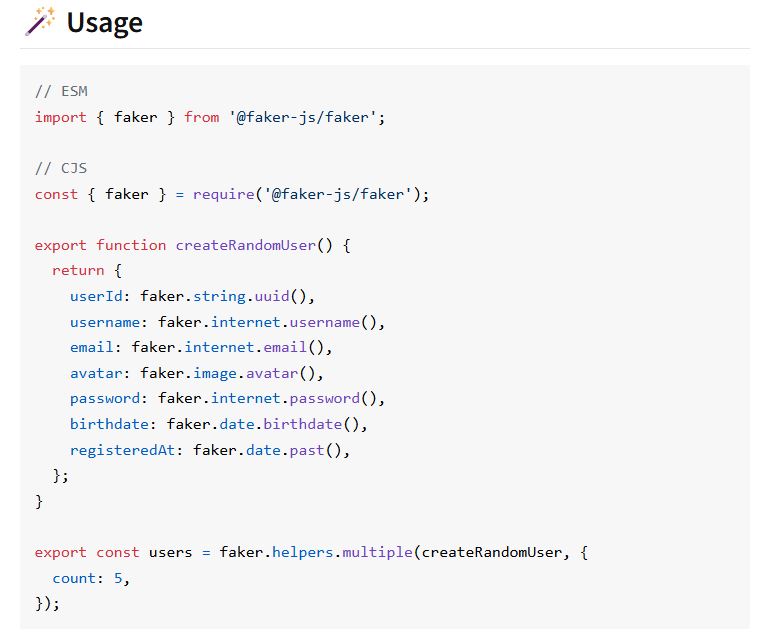
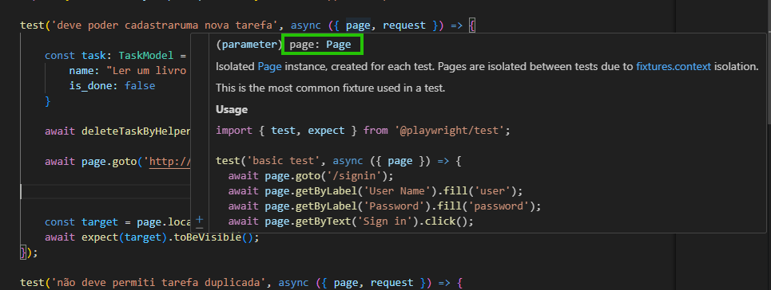

# playwright_express

## Instalação do projeto

- **1º** Instalação do node    
- **2º** Instalação do yarn  
- **3º** Entre no diretório de trabalho (playwright_mark) e instale o playwright

        yarn create playwright

 Comandos para a execução do playwright  

 
 
Obs1: o playwright baixa seus próprios browser para trabalhar;  

Obs2: seguindo o playwright.config.ts, cada teste é executado em paralelo em 3 navegadores. Se não quiser que execute em todos, utilizar o comando acima que cita o navegador de execução;  

Obs3: se quiser executar relatórios, executar o comando:   
        
           yarn playwright show-report

- **4º** Baixar, descompactar e levar para o diretório playwright_express os arquivos de mark_dev_build, fornecido no curso para criação do ambiente de teste

- **5º** Em playwright_express > apps > api 
executar o comando para instalação das dependências do projeto

        yarn install  

A pasta do node_modules será acrescentada na pasta api.   

- **6º** No mesmo diretório, iniciar o banco de dados:     

        yarn db:init

Vai iniciar a estrutura de dados do projeto, criando as tabelas, etc. 

- **7º** No mesmo diretório, subir as APIs  

        yarn dev       

- **8º** Abrir uma nova aba no terminal enquanto a API executa. Em playwright_express > apps > web executar o comando para subir a aplicação web:  

        yarn dev

Se der problema pela ausência do http-server, instale-o e depois repita o comando acima.   

        npm install -g http-server

Para acessar a aplicação: http:localhost/3000

(Ou, como originalmente no projeto, 8080)

- **9º** Para executar o playwright, acessar o diretório playwright_express > playwright_mark e executar: 

        yarn playwright test

## Estrutura de teste

        import {test, expect} from '@playwright/test';

        test('webapp deve estar online', async ({page}) => {
            await page.goto('http://localhost:3000');
        });

- **1º sempre importar o test e o except**
        
test: É a função central para definir e agrupar seus testes. É a maneira de registrar um novo caso de teste com este framework.

expect: É a função usada para fazer asserções (ou verificações) no seu teste.

- **2º Page**

O objeto page (do tipo Page no TypeScript) é a API central que você usa para interagir com o conteúdo da página web que está sendo testada.
Ele tem métodos para executar quase todas as ações que um usuário faria manualmente no navegador.

- **3º async e await**

Tanto o Javascript quanto o Typescript são linguagens async. Isso que dizer que elas executam ações em paralelo, sem enfileirá-las.  

O async é a forma de declarar uma função como assíncrona. 

O await é uma palavra-chave que só pode ser usada dentro de uma função async. Ela pausa a execução do teste naquela função até que a Promise (retornada pela operação, como page.goto()) seja resolvida (ou seja, concluída com sucesso ou falhada).

## Diferença entre Playwright e o Cypress no assincronismo. 

Se tanto o **Javascript** quanto o **Typescript** são linguagens **assíncronas**, porque somente no Playwright é necessário definir a função como assíncrona? 

O **Cypress** é baseado em uma fila de comandos interna (Command Queue). Não precisa de await porque ele enfileira comandos e os executa de forma síncrona, um de cada vez, internamente.

ex: cy.visit() / cy.click()

O **Playwright** é baseado em Promises (async/await), puro JavaScript. O Playwright injeta esperas automáticas, mas a estrutura de código precisa do await para gerenciar a ordem das Promises.

## Execução do Playwright sem ser por linha de comando 

        yarn playwright test --headed

## Debug

Abre uma página em branco e você precisa ir pela tela do playwright avançando cada linha do código para poder debugar. 

        yarn playwright test --debug

## Formatação do documento

Para formatar o documento da maneira certa, clicar com botão direito do mouse > format document

## Dados fake

Para criar massa de dados fake, entrar na biblioteca faker do npm. 

Instalar no projeto como dependência de desenvolvimento:

        yarn add @faker-js/faker -D

## Tipo da propriedade

O typescript é tipado. Então em diversos momentos vai precisar colocar o tipo da propriedade para criar as funções. 

Passar o mouse por cima da propriedade. 

